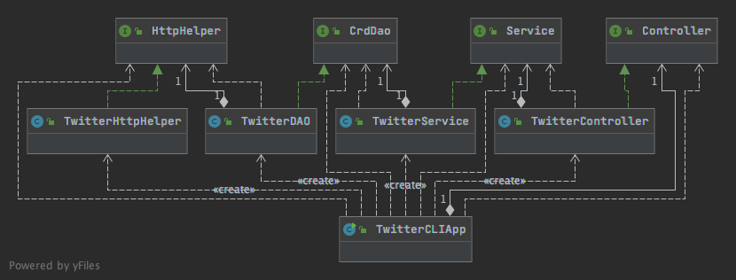

# Java Twitter App
## Introduction
Twitter is currently one of the most, if not the most used social media platform.
Users can post, delete, view and use various other features provided by twitter 
Twitter Graphical User Interface (GUI). In this app, we want to make a command line
app which can perform basic twitter functionalities given appropriate user input
using Java. To simplify, our app will automate the basic functionalities. We will
interact with Twitter API endpoints using our own REST APIs. We will utilize the
MVC (Module View Controller) architecture without the View layer while building
our app. Being an MVP (Most Viable Product) solution we have automated post, show 
and delete feature to get us started.

## Usage

We can invoke our app with following program arguments:

* To `post` a tweet: The app will build a `Tweet` object based on the provided text and
latitude and longitude and post using Twitter API end-point and return the posted tweet in 
JSON format which we will parse and show.
```
TwitterCLIApp "post" "tweet_text" "latitude:longitude"
```
Arguments:
 * tweet_text         - tweet_text cannot exceed 140 
 UTF-8 encoded characters. 
 * latitude:longitude - Geo location.

Example Usage:

````
TwitterCLI "post" "test post" "0:0"
````

* To `show` a tweet: The app get the JSON reponse object based on the provided tweet_id 
using Twitter API end-point and parse and show the appropriate fields according to the optional
parameters.
```
TwitterCLIApp show tweet_id [field1,fields2]
```
Arguments:
 * tweet_id  - Tweet ID. Same as id_str in the tweet object
 * [field1,fields2]  - A comma-separated list of top-level fields 
from the tweet object (similar to SELECT clause in SQL)

Example Usage:
````
TwitterCLI show 1097607853932564480 "id,text,retweet_count"
````

* To `delete` a tweet: The app deletes the tweet based on the provided tweet_id 
using Twitter API end-point and parse and show the deleted twitter response JSON object.

````
TwitterCLI delete [id1,id2,..]
````
Arguments:
 * tweet_ids - A comma-separated list of tweets.

Example Usage:
````
TwitterCLI delete 1200145224103841792
````

## Packaging and Building

We have used `Maven` to build the project. So, in order to 
manage building dependencies a `pom.xml` file needs to be written.

We have used `Java 8` as our `JDK`. To use the same add following
lines in the file.

````
<properties>
    <maven.compiler.source>1.8</maven.compiler.source>
    <maven.compiler.target>1.8</maven.compiler.target>
</properties>
````
Follwing dependencies needs to be added in the file:

In order to `user authorization` and `signing request` add the 
following,

````
<dependency>
     <groupId>oauth.signpost</groupId>
     <artifactId>signpost-commonshttp4</artifactId>
     <version>1.2.1.2</version>
</dependency>
````

To process JSON objects add following,

````
<dependency>
     <groupId>com.fasterxml.jackson.core</groupId>
     <artifactId>jackson-databind</artifactId>
</dependency>
````
To use `Mockito` and `Junit` to write test classes add following,

````
<dependency>
     <groupId>org.mockito</groupId>
     <artifactId>mockito-core</artifactId>
     <scope>test</scope>
</dependency>
<dependency>
     <groupId>junit</groupId>
     <artifactId>junit</artifactId>
     <scope>test</scope>
</dependency>
````
To add `Spring` framework add following,
````
<dependency>
     <groupId>org.springframework.boot</groupId>
     <artifactId>spring-boot-starter-web</artifactId>
</dependency>

<dependency>
     <groupId>org.springframework.boot</groupId>
     <artifactId>spring-boot-starter-test</artifactId>
     <scope>test</scope>
</dependency>

<build>
   <plugins>
     <plugin>
       <groupId>org.springframework.boot</groupId>
       <artifactId>spring-boot-maven-plugin</artifactId>
     </plugin>
   </plugins>
</build>
 ````

## Design

* ### UML Class Diagram


* ### Classes, Interfaces, Methods:

    * `TwitterCLIApp`: This is the main entry-point for our app. This class has
    a `Main` method that will set the authorization keys and tokens to interact
    with twitter API end-points.This method will create all the dependencies 
    and pass them to the appropriate classes to instantiate.
     
    `Main` method will invoke the `run` 
    method that will decide the appropriate method from program arguments e.g. 
    the pseudocode of `run` method is following, 
    ````
    if arg = post:
    call controller.post()
  if arg = show:
    call controller.show()
  if arg = delete:
    call controller.delete()
    ```` 
    * `TwitterController`: This class implements the  `Controller` interface. It implements
    primarily three methods named as `post`,`show`,`delete` alongside some utility functions.
    This class deals with the expected and actual number of program arguments provided
    by user and assigns them and calls the appropriate `service` module methods.
    Following is the pseudocode:
    
     ````
  function post():
        if number_of_args != expected_number_of_args:
            throw appropriate runtime exception
        call service.post(args)
  function show():
        if number_of_args != expected_number_of_args:
            throw appropriate runtime exception
        call service.show(args)
  function delete():
        if number_of_args != expected_number_of_args:
            throw appropriate runtime exception
        call service.delete(args)
  ````
  * `TwitterService`: This class implements the  `Service` interface. It implements
      primarily three methods named as `post`,`show`,`delete` alongside some utility functions.
      This class deals with the validation of program arguments provided
      by user and assigns them and calls the appropriate `Dao` module methods.
      Following is the pseudocode:
      
    ````
    function post():
          if !validate_arguments:
              throw appropriate runtime exception
          call CrDao.post(args)
    function show():
          if !validate_arguments:
              throw appropriate runtime exception
          call CrDao.show(args)
    function delete():
          if !validate_arguments:
              throw appropriate runtime exception
          call CrDao.delete(args)
     ````
   * `TwitterService`: This class implements the  `Service` interface. It implements
         primarily three methods named as `post`,`show`,`delete` alongside some utility functions.
         This class deals with the validation of program arguments provided
         by user and assigns them and calls the appropriate `Dao` module methods.
         Following is the pseudocode:
         
     ````
     function post():
        if !validate_arguments:
           throw appropriate runtime exception
           call CrDao.post(args)
     function show():
        if !validate_arguments:
           throw appropriate runtime exception
           call CrDao.show(args)
     function delete():
        if !validate_arguments:
           throw appropriate runtime exception
           call CrDao.delete(args)
     ````
   * `TwitterService`: This class implements the  `Service` interface. It implements
         primarily three methods named as `post`,`show`,`delete` alongside some utility functions.
         This class deals with the validation of program arguments provided
         by user and assigns them and calls the appropriate `Dao` module methods.
         Following is the pseudocode:
         
     ````
     function post():
        if !validate_arguments:
           throw appropriate runtime exception
           call CrDao.post(args)
     function show():
        if !validate_arguments:
            throw appropriate runtime exception
            call CrDao.show(args)
     function delete():
        if !validate_arguments:
            throw appropriate runtime exception
            call CrDao.delete(args)
     ````
   * `TwitterDAO`: We have used `DAO` pattern for data retrieval access and processing. This module deals
        with all the data related functions.This class implements the  `CrdDao` interface and it accepts
        the `Tweet` class as  a parameter. This class specifies all the necessary API end-points and 
        build appropriate `URI` to interact with Twitter API's and perform appropriate tasks using 
        `HttpHelper` module.
        
    ````
    function post():
        post_uri = makeuri(post_endpoint, args)
        response = HttpHelper.post(post_uri)
        print(parse_response(response))
    function show():
        show_uri = makeuri(show_endpoint, args)
        response = HttpHelper.get(show_uri)
        print(parse_response(response))
    function delete():
        delete_uri = makeuri(delete_endpoint, args)
        response = HttpHelper.post(delete_uri)
        print(parse_response(response)))
    ````
  
  * `TwitterHttpHelper`: This class implements the HttpHelper interface. It implements the 
  `httpGet` and `httpPost` method. Using the Twitter provided developer authorization
  credentials it creates a `OAuthConsumer` object and also create an `HttpClient` object
  to request and receive an `Http` response.
      
     ````
     function httpPost():
        HttpResponse_object = HttpClient_object.post(http_post_request_object)
     function show():
        HttpResponse_object = HttpClient_object.get(http_get_request_object)
  
     ````
  * `Tweet`: The official Tweet model is huge and consists of lots of exciting functionalites.
  Being an MVP solution we considered a simplified tweet model. A sample simplified `Tweet`
  is following,
  
  ````
  {
    "created_at" : "Thu Nov 28 20:11:33 +0000 2019",
    "id" : 1200145224103841792,
    "id_str" : "1200145224103841792",
    "text" : "test post",
    "entities" : {
      "hashtags" : [ ],
      "user_mentions" : [ ]
    },
    "retweet_count" : 0,
    "favorite_count" : 0,
    "favorited" : false,
    "retweeted" : false
  }
  ````
  Following is the description of the fields:
 
     1. `created_at`: the exact timestamp when the tweet was created
     2. `id`: Twitter provided tweet id
     3. `id_str`: Tweet id in `String` format
     4. `text`: User provided tweet text
     5. `entities`: this field consist all the user_mentions and hashtags
     included in the tweet text
     6. `favorite_count`: self-explanatory
     7. `retweet_count`: self-explanatory
     8. `favorited`: whether this tweet is favorited or not
     9. `retweeted`: whether this tweet is retweeted or not
  

## Testing frameworks and logging:

We have used `Mockito` and `Junit 4` to write tests for both 
`Unit test` and `Integration test`. Properly logging is maintained
using `self4j` framework. Appropriate Exceptions have been thrown as
required.


##Performance Issues:

1. In this app, the number of classes and interfaces are fairly low. But if 
the number of classes grows, it will be almost impossible for us to manage
and inject the dependencies manually. 
2. For large scale applications, the `DAO` pattern is not suitable for data
access and retrieval.

## Improvements:
1. We have already addressed the first performance issue and attempted to 
solve in an updated version of this solution as well. Three different
solutions are inclueded in the `Spring` module.
    * Using the `Bean` approach in `Spring` framework:
    We have used the `Spring` framework to facilitate our dependency 
    management. We have annotated all the modules with `Bean` 
    `Annotation` to instruct the  `Spring` framework to consider
    them as `Bean` object and construct them automatically utilizing
    automatic dependency injection. This approach solves some of
    our problem but still we need to manually declare those `Beans`
    in the entry-point which might be uncotrollable if `Bean` number
    grows.
    
    * Using the `Component` approach in `Spring` framework: In this
    approach, we have specified all the classes as either a 
    `Component`, `Controller`, `Service`, `Repository` using 
    respective `Annotation`s. The advantage of this approach in
    contrast with the previous approach is that here we can specify
    a base package and `Spring` will automatically scan that 
    package and construct those classes using automatic dependency
    injection finding `Autowired` annotation. This will solve our 
    first issue.
    
    * Transfroming the app to a `SpringBootApplication`:
    We have added another abstract layer on top of our entry-point
    class and transformed this newly added class to a 
    `SpringBootAppplication`. We get the automatic dependency
    injection, construction of object using the dependency
    injection here as well.
 
 2. To solve the second issue and make our app adaptable to 
 growing number of classes we can use the `Repository` data
 access pattern.
    
    
    
    
    
  
    


