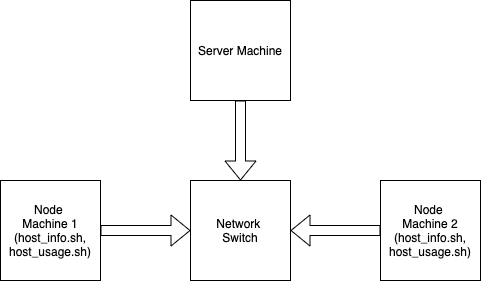

# Linux Cluster Monitoring Agent

## Introduction
The Jarvis Linux Cluster Administration (LCA) team manages a Linux cluster of 10 nodes/servers which are running CentOS 7. These servers are internally connected through a switch and able to communicate through internal IPv4 addresses.The LCA team needs to record the hardware specifications of each node and monitor node resource usages (e.g. CPU/Memory) in realtime (see appendix A). The collected data should be stored in an RDBMS database. LCA team will use the data to generate some reports for future resource planning purposes (e.g. add/remove servers). This project implement an MVP solution to help the LCA tem to meet their business needs. Being a MVP solution, this implementation invloves single linux machine instead of cluster.

## Overview
This solution is a Cluster monitoring agent. It will monitor the hardware specification and hardware usage in each of the node machines and store in the instance. Server will be able to query and extract important usage information. Being an MVP Solution, in this case, both server and node is the same machine. PostgreSQL is used as the database to store hardware usage and specifications. This solution will provide the necessary scripts to create, start and stop a Postgresql instance in a docker container. It will also provide necessary scripts to extract and store hardware specifications and usage data in the PostgreSQL instance. Futhermore, it will also provide sql files to create and populate database table and perform some sample queries.

  
## Architecture
* A PostgreSQL instance is used to store all data
* ./scripts directory has all the neccessary scripts about hardware
	* host_info.sh: script to extract necessary hardware specifications and insert into the host_info table instance
	* host_usage.sh: script to extract real-time hardware usage info and insert into the host_usage table in the instance
	* psql_docker.sh: sctipt to create, start, stop the instance in a docker container
* ./sql directory has all the neccessary script to create database table and perform query
	* ddl.sql: creates both host_info and host_usage table in the database
	* queries.sql: consists some sample queries to perform on the stored data
		1. Grouping nodes by `cpu_number` and `total_mem`
		2. Find out the average memory used (over a 5 minute interval) for each of the nodes
		3. Find faulty nodes (those nodes which were unsuccessfull to update hardware usage data for three times) 
## Database Tables
Database `host_agent` has two tables. All the fields in both of the tables have NOT NULL constraint. 
* `host_info` table:\
This table will have the necessary hardware specifications data. The current node machine will extract the following data and insert these datas in this table.
	* `id`: Unique id representing each node. Assigned and auto-incremented by psql instance. This field is the primary key in this table.
	* `hostname`: The hostname or machine name of the current node. This field has Unique constraint.
	* `cpu_number`: The number of cores in the cpu
	* `cpu_architecture`: The architecture of the cpu
	* `cpu_model`: The model name of the cpu
	* `cpu_mhz`: The speed of the cpu
	* `L2_cache`: L2_cache size; measured in KB
	* `total_mem`: Memory size in the current node; measured in KB
	* `timestamp`: UTC timestamp when data was being collected
* `host_usage` table:\
This table will have the continuous hardware usage data. The current node machine will extract the following data and insert these datas in this table each and every minute.       
	* `timestamp`: UTC timestamp when data was being collected
	* `host_id`: The id of the current node. This field is a foreign key for this table and corresponds to the `id` of the `host_info` table. 	
	* `cpu_number`: The number of cores in the cpu
	* `memory_free`: The size of the idle memory; measured in MB
	* `cpu_idle`: The time percentage of the cpu being idle
	* `cpu_kernel`: The time percentage of the cpu running kernel codes/system codes
	* `L2_cache`: L2_cache size; measured in kB
	* `disk_io`: The number of current disk I/O operations in progress
	* `disk_available`: The available disk space; measured in MB
## Usage
* Provisioning PostgreSQL instance\
Create and start the docker container which will run a PostgreSQL instance
```
./linux_sql/psql_docker.sh create db_username db_password
./linux_sql/psql_docker.sh start
```
* Create `host_agent` database  using psql CLI\ 
```
psql -h localhost -U postgres -W
postgres=# CREATE DATABASE host_agent;
```
* Create the `host_info` and `host_usage` tables\
Executing the `ddl.sql` will create both the tables in the created database.
```
psql -h localhost -U postgres -W -d host_agent -f ./linux_sql/sql/ddl.sql
```
* Insert `host_info` data from current node to `host_info` table\
Executing the `host_info` script will insert the hardware specifications data in the `host_info` table. We are assuming that the hardware specifications will be same during the time. So, this escripts needs to be run only once.
```
./linux_sql/scripts/host_usage.sh psql_host psql_port db_name psql_user psql_password
```
* Insert `host_usage` data from current node to `host_usage` table\
Executing the `host_usage` script will insert the hardware usage data in the `host_usage` table. This data needs to be updated continuously. Automating the execution of this script for each and every minute will be disussed in the next instruction.
```
./linux_sql/scripts/host_usage.sh psql_host psql_port db_name psql_user psql_password
```
* Set up crontab to extract `host_usage` data continuously in the background\
A crontab job needs to be set up which will extract `host_usage` data continuously and update the `host_usage` table.
```
crontab -e
#add this to the opened file
* * * * * bash /home/centos/dev/jrvs/bootcamp/linux_sql/host_agent/scripts/host_usage.sh localhost 5432 host_agent postgres password > /tmp/host_usage.log

#verify the job
crontab -l
```
## Improvements
* In this solution, it was assumed that hardware specifications will not change. Making the solution adaptable to the hardware change will ne be needed. Adding a  helper script to detect hardware changes will help us making the solution more adaptable.
* Adding a script to find the faulty nodes and send alerts to the faulty nodes will help troubleshoot the node's performance.
* The `host_usage` data can grow very big. Adding a script to automatically filter out unnecessary old usage data can reduce storage usage.:w

