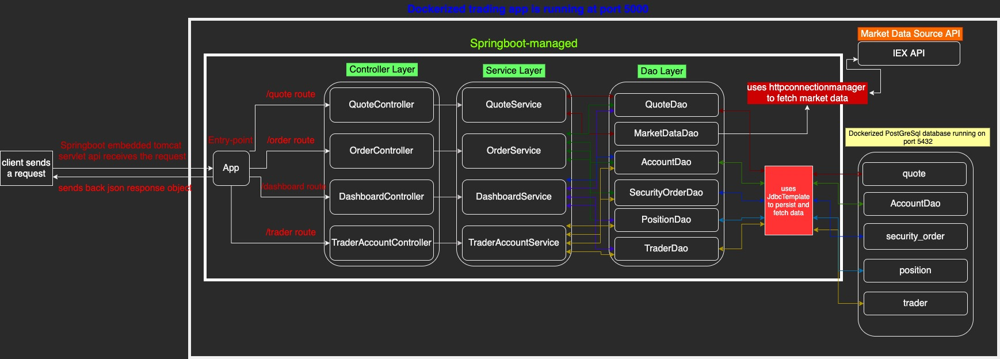
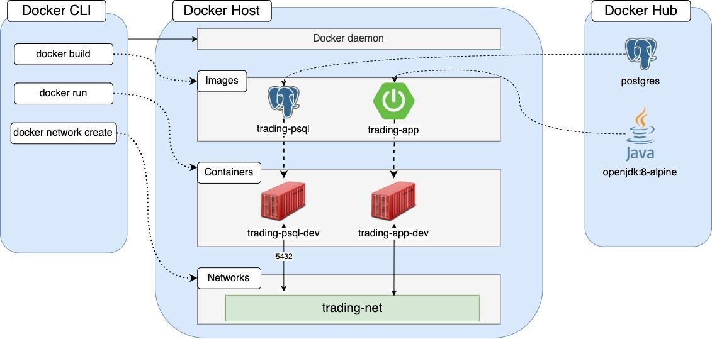

# Java Stock Market Trading App

## Introduction
This is a `Java` based Stock market trading app. It shows the user the available securities and users can buy and sell stocks. It can create a new trader, account, quotes. It can update them and delete them as well. This app retrieves market data from `IEX cloud API` and persist application data in a `PostgreSQL` database. This app is based on Microservice architecture and managed by `Springboot`, packaged by Maven. Both the database and app are dockerized. Springboot embedded Tomcat server is used to handle HTTP requests. Users can consume the API responses using Postman, chrome, or using any Client API. The endpoints are tested using `Postman` and `SwaggerUI`.

## Usage

**Prerequisites**: We need to install docker to run the app. We will assume the Operating system as CentOS 7. If Docker is installed, we need to check the version using the following command as it needs to be 17.05 or higher.
````
docker -v
````
If Docker is not already installed or if the docker version is old, the following command will install the latest docker.

```
sudo yum remove -y docker \
                  docker-client \
                  docker-client-latest \
                  docker-common \
                  docker-latest \
                  docker-latest-logrotate \
                  docker-logrotate \
                  docker-engine

sudo yum install -y yum-utils device-mapper-persistent-data lvm2

sudo yum-config-manager \
    --add-repo \
    https://download.docker.com/linux/centos/docker-ce.repo

sudo yum -y install docker-ce docker-ce-cli containerd.io
```

The following command will start the Docker daemon

```
sudo systemctl start docker && sudo docker -v
```

Both of our app and PostgreSQL database will be dockerized using the corresponding Dockerscripts. Our database will be hosted by `trading_psql_dev` container and our app will be hosted by the `trading_app_dev` container. First, we need to create a docker network so that our `trading_psql_dev` container and `trading_app_dev` container can interact with each other. The following command will create the network.

```
docker network create --driver bridge trading-net

```

**Docker Scripts**:
* /psql/Dockerfile: This is the script which will build our docker image on top of base image `postgres:9.6-alpine`. We need to build our database image because we need to initialize the tables in our `PostgreSQL` database. The initialization scripts are inside the `/psql/sql_ddl` directory. In the `/psql` directory we will run the following command.

```
docker build -t trading_psql .
```
the `trading_psql` will be our docker image. Using this image we will create `trading_psql_dev` container which will have all the tables initialized for the `trading_app_dev` container to consume.

```
docker run --name trading_psql_dev \
-e POSTGRES_PASSWORD=password \
-e POSTGRES_DB=jrvstrading \
-e POSTGRES_USER=postgres \
--network trading-net \
-d -p 5432:5432 trading_psql
```
Now, we will build our `trading_app_dev` image with the help of the docker script in `./Dockerfile` and similarly the `trading_app` container with this image.

```
docker build -t trading_app .
```
```
docker run --name trading_app_dev \
-e "PSQL_URL=jdbc:postgresql://trading_psql_dev:5432/jrvstrading" \
-e "PSQL_USER=postgres" \
-e "PSQL_PASSWORD=password" \
-e "IEX_PUB_TOKEN=${IEX_PUB_TOKEN}" \
--network trading-net \
-p 5000:5000 -t trading_app
```

The `trading_app_dev` will listen on `port:5000`. Now, we can use the endpoints will `Swagger API (http://localhost:5000/swagger-ui.html)`


## Architecture


We have utilized the MVC architecture. In other words, this architecture can be termed as three-tier-architecture as well. We have the following aspects of our design architecture.

* `Controller`: This layer handles the HTTP requests. Different routes have their controller modules. Endpoints are mapped into the corresponding controller's methods. Instead of using views (HTML), these methods return the response as a JSON object which can be consumed by Postman, Swagger API, chrome, etc.

* `Service`: This layer deals with business logic. It validates the input and performs appropriate operations. Each controller has a corresponding service layer. 

* `Dao`: This layer persists and retrieves data from the `PostgreSQL` database. Each of the `Data Domain Model` has its own Dao. 

* `Models`: These are the data domain models. These are the POJO classes which will be used to facilitate CRUD and query operations on the database and also sending response objects.

* `Views`: These are the subset of Models that are view or read-only.

* Market Data Source and Storage: We have used `http://iexcloud.io/` as the API to provide market data (e.g. stock quote). Although IEX data is not real-time, it's a good source to obtain data for this MVP.

* PostgreSQL database instance: The Java application does not store any data. We have used the `PostgreSQL` database to persist application data. These help us decouple the application and data storage. We cache the data in this database so that in case of application instance failure, we do not lose the data. The database has following tables inside `trader`, `account`, `quote`, `security_order`, `position`.

* Springboot & Tomcat: This is a springboot based Java application. Springhboot has embedded Tomcat server which we used to get and set up HTTP connections. Springboot IoC container does the component scan in the working package and create necessary beans via dependency injection and initialize the layers to process requests.

If we see this architecture from three-tier architecture then the tiers are following.

* `Client tier`: Users can use HTTP clients to consume the Response objects.

* `Application tier`: The springboot based Java app that only process data.

* `Database tier`: The application data are stored in the database instance.

## REST API Usage:

* `Swagger`: Swagger UI, a part of Swagger, is an open-source tool that generates a web page that documents the APIs generated by the Swagger specification. This UI presentation of the APIs is user friendly and easy to understand, with all logic complexity kept behind the screen.

* `QuoteController`: This controller handles all the requests in `/quote` route. It shows, updates, saves data using `QuoteService` layer methods.

  * GET `/quote/dailyList`: shows all the quotes available in this trading market to trade. `QuoteService` with the help of `QuoteDao` retrieves all the records in the `quote` table and sends it as a JSON object.

  * GET `/quote/iex/ticker/{ticker}`: show the `iexQuote` corresponding to the `{ticker}`. `QuoteDao` extracts the data from the `IEX market data API` and sends it as a response. It also persists the data in the `Quote` table.

  * POST `/quote/tickerId/{tickerId}`: Add a new `Quote` in the dailyList. `QuoteDao` creates a new `Quote` and persist it into the `quote` table.

  * PUT `/quote/`: Update a given `Quote` in the `quote` table. `QuoteDao` updates the given `Quote` using the payload data and persist it into the `quote` table. 
  
  * PUT `/quote/iexMarketData`: Update all the `Quote`s in the `quote` table using the IEX Market API values. `QuoteDao` updates all the `Quote` to the updated data extracted from IEX Market Data API and persist them into the `quote` table.

* `TraderAccountController`: This controller handles all the requests in `/trader` route. It shows, updates, saves data using `TraderAccountService` layer methods.

  * POST `/trader/*`: There are two endpoints that creates a `Trader` and corresponding `Account` data. Each `Trader` can have only one account to simplify. `TraderAccountController` invokes `TraderAcccountService` which eventually uses `TraderDao` and `AccountDao` to create and persist `trader` and `account` respectively. The two endpoints are the following.
    * POST `/trader/`: For this endpoint, it uses the payload data to create.
    * POST `/trader//firstname/{firstname}/lastname/{lastname}/dob/{dob}/country/{country}/email/{email}`: For this endpoint, it uses the embedded url data to create.

  * PUT `/trader/deposit/traderId/{traderId}/amount/{amount}`: Deposit fund to the trader account. `AccountdDao` adds fund to the corresponding `Account` and persist it into the `account` table.

  * PUT `/trader/withdraw/traderId/{traderId}/amount/{amount}`: Withdraw fund to the trader account. `AccountdDao` withdraws fund from the corresponding `Account` and persist it into the `account` table.

  * DELETE `/trader/traderId/{traderId}`: Delete the corresponding `Trader`. `TraderDao` deletes the `Trader` by closing all positions and withdrawing all the funds. `SecurityOrderDao` deletes all the corresponding `SecurityOrders` from the `security_order` table, `AccountDao` deletes the corresponding `Account` from the `account` table and then `TraderDao` deletes the corresponding `Trader`.

* `OrderController`: This controller handles all the requests in `/order` route. It shows, updates, saves data using `OrderSerice` layer methods.

  * POST `/order/marketOrder`: Submit a market order. This endpoint submits a buy or sells market order based on the payload values. `SecurityOrderDao` creates and persist a `SecurityOrder` in the `security_order` table. It also updates the corresponding `Account` amount.

* `DashboardController`: This controller handles all the requests in the `/dashboard` route. It shows, updates, saves data using `DashboardService`layer methods.

  * GET `/dashboard/portfolio/traderId/{traderId}`: Show portfolio by traderID. In this endpoint, `DashboardService` invokes `PositionDao` and `QuoteDao` to create a `PortfolioView`

  * GET `/dashboard/profile/traderId/{traderId}`: Show trader profile by traderID. In this endpoint, `DashboardService` invokes `TraderDao` and `AccountDao` to create a `TraderAccountView`


## Docker Deployment


First, we create a docker network named as `trading-net` so that our app container and database container can interact with each other.

  * `trading_psql_dev` container creation: `trading_psql_dev` will host the `PostgreSQL` database which will be used by our app. We wrote the needed `Dockerfile` which will be used to build the image for the container. The base image used is `postgres:9.6-alpine`. We were needed to create an image on top of the base image because we need all our tables initialized. The `initialization scripts` were needed to be copied into /docker-entry point-initdb.d/ directory. So, in our Dockerfile, we copied our `./psql/sql_ddl/schema.sql` file into that directory. This SQL file initializes all our tables.
  Then we use the following command to build the image.

    ```
    docker build -t trading_psql .
    ```
    And then we use the following command to create and run the `trading_psql_dev` container

    ```
    docker run --name trading_psql_dev \
    -e POSTGRES_PASSWORD=password \
    -e POSTGRES_DB=jrvstrading \
    -e POSTGRES_USER=postgres \
    --network trading-net \
    -d -p 5432:5432 trading_psql
    ```

  * `trading_app_dev` container creation: `trading_app_dev` will host the stock market trading app. We wrote the needed `Dockerfile` which will be used to build the image for the container. We have done this image creation in two phases. In the build phase, we use the `maven` base image as build and we build our app and then in the packaging stage we run the packaged `.jar` file.

    ```
    docker build -t trading_app .
    ```
    And then we use the following command to create and run the `trading_psql_dev` container

    ```
    docker run --name trading_app_dev \
    -e "PSQL_URL=jdbc:postgresql://trading_psql_dev:5432/jrvstrading" \
    -e "PSQL_USER=postgres" \
    -e "PSQL_PASSWORD=password" \
    -e "IEX_PUB_TOKEN=${IEX_PUB_TOKEN}" \
    --network trading-net \
    -p 5000:5000 -t trading_app
    ```


## Improvements:

1. We imposed a constraint on the design that each trader can have only one account. We could allow the traders to have multiple accounts which will increase flexibility.

2. We have used an RDBMS database in this solution. We will analyze the performance using a NoSQL database. This

3. Indexing the database might reduce the database searching time.

4. More endpoints could be introduced.

5. Implement other orders alongside market order e.g. limit orders, stop-loss orders.